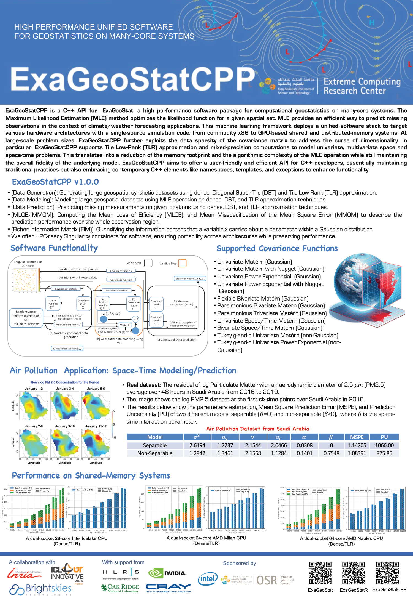

# ExaGeoStat

The **Exascale GeoStatistics** project (ExaGeoStat) is a parallel high-performance unified framework for computational
geostatistics on many-core systems. The project aims to optimize the likelihood function for a given spatial data to
efficiently predict missing observations in the context of climate/weather forecasting applications.
This machine learning framework proposes a unified simulation code structure to target various hardware architectures,
from commodity x86 to GPU accelerator-based shared and distributed-memory systems. ExaGeoStat enables statisticians to
tackle computationally challenging scientific problems at large-scale while abstracting the hardware complexity through
state-of-the-art high-performance linear algebra software libraries.

### ExaGeoStatCPP
ExaGeoStatCPP is a C++ API for ExaGeoStat that aims to offer a user-friendly and efficient API for C++ developers, essentially
maintaining traditional practices and embracing contemporary C++ elements like namespaces, templates, and exceptions to enhance functionality.

### ExaGeoStatR : R Interface of ExaGeoStat
R is a powerful and versatile tool for scientific computing, offering a wide range of statistical and graphical
techniques, strong community support, and the flexibility to integrate with other programming languages.
Its open-source nature and extensive package ecosystem make it an invaluable resource for researchers and data scientists.
Therefore, we decided to create ExaGeoStatR: An interface for functionalities provided by ExaGeoStatCPP to make use of R's various benefits.

### Vision of ExaGeoStat/ExaGeoStatCPP
The ExaGeoStat/ExaGeoStatCPP project is a collaboration between the KAUST Spatial Statistics group and the Extreme Computing Research
Center (ECRC). Lies not in a new algorithm nor a new dataset, but in demonstrating the routine use of the larger datasets becoming available to geospatial
statisticians, thanks to the implementation of state-of-the-art statistical algorithms on
High Performance Computing (HPC) hardware.

We have built a standalone software framework (ExaGeoStat/ExaGeoStatCPP) that can run on a variety
of hardware resources, including GPUs and massively distributed systems such as Shaheen-II,
KAUST's Cray XC40 supercomputer, HLRS HPE Apollo (Hawk), ORNL Summit (OLCF-4) supercomputer, and Riken Fugaku supercomputer,
to create a statistical model to predict environmental data (i.e., temperature, flow rates, soil moisture,
wind speed, air pollution, etc.) at spatial locations on which data
is missing, and to exploit large amounts of data to reduce the effect of individual measurement
errors. The best-known methods for such statistical processing have a cost that grows rapidly
in the size of the dataset, namely, in proportion to its cube or third power. Thus, increasing
the size of the dataset by a factor of ten drives up the cost of the computation by a factor of
a thousand while simultaneously driving up the memory requirements by a factor of a hundred.

For instance, according to this cubic growth in complexity, a computation that requires one
minute would require nearly 17 hours on a dataset just ten times larger. This creates a
computational strain on standard statistics software, for which contemporary data sizes
were not anticipated, and even if possible, it puts the computation beyond the interactive
attention span of the analyst. Parallelism (assigning thousands of processors to a single task) and Moore's Law allow
leading-edge computers to handle such "big data"
with ease, but the software bridge must be built. Furthermore, the software interface
must resemble the interactive one with which working statisticians are familiar.

To summarize, the combination of emerging computing capabilities and emerging datasets
promises significant advances in statistical analyses of environmental and many other
phenomena. Such cross-disciplinary advances are natural at KAUST, so this
relatively low-hanging fruit was ours to harvest earliest. Our roadmap now takes ExaGeoStat
a step further on the algorithmic side by integrating tile low-rank matrix approximation.
This low-rank matrix approximation permits the exploitation of the data sparsity of the operator with user-controlled
numerical accuracy. This further expands practical problem sizes for
statisticians with modest computational resources.

## Installation

> Note: Installation requires at least **CMake of version 3.2**. to build ExaGeoStatCPP.

### C++ source code installation
To install the `ExaGeoStat` project locally, run the following commands in your terminal:

1. Clone the project repository to your local machine:
   ```bash
   git clone https://github.com/ecrc/ExaGeoStatCPP.git 
   ```

2. Navigate to the cloned directory:
   ```bash
   cd ExaGeoStatCPP
   ```

3. Run `configure` script with the flag `-h` for help, to know the supported options and their corresponding flags.
   ```bash
   ./configure -h
   ```

4. Run `clean_build.sh` script with the flag `-h` for help, to know the needed arguments to run with your specific options.
   ```bash
   ./clean_build.sh -h
   ```

5. Export the installation paths of the dependencies to your `.bashrc` file, e.g.
   ```bash
   export PKG_CONFIG_PATH=$PWD/installdir/_deps/DEPENDENCY_NAME/lib/pkgconfig:$PKG_CONFIG_PATH
   ```
   or copy/paste the output pkg-config paths from the configure step

Now, you can use the pkg-config executable to collect compiler and linker flags for
ExaGeoStatCPP.

### R package installation
1. Open the R prompt window by simply running `R` command in the terminal, inside the prompt, we will install needed packages by running the following commands:
   ```R
   install.packages(Rcpp)
   install.packages("assert")
   ```

2. close the R prompt and return to the terminal. Run the following command, make sure your current path is the ExaGeoStat project directory

   ```commandline
   R CMD INSTALL . --configure-args="-r"
   ```

> For more detailed information on installing ExaGeoStat with different configurations and enabling technologies such as CUDA, MPI, R, etc., please refer to the [User Manual](USER_MANUAL.md)


## Usage
#### C++ Example
```C++
int main(int argc, char **argv) {

    // Create a new configurations object.
    Configurations configurations;
    // Initialize the arguments with the provided command line arguments
    configurations.InitializeArguments(argc, argv);
    // Initialize the ExaGeoStat Hardware
    auto hardware = ExaGeoStatHardware(configurations.GetComputation(), configurations.GetCoresNumber(),
                                       configurations.GetGPUsNumbers(), configurations.GetPGrid(),
                                       configurations.GetQGrid());    // Load data by either read from file or create synthetic data.
    std::unique_ptr<ExaGeoStatData<double>> data;
    ExaGeoStat<double>::ExaGeoStatLoadData(configurations, data);
    // Modeling module.
    ExaGeoStat<double>::ExaGeoStatDataModeling(configurations, data);
    // Prediction module
    ExaGeoStat<double>::ExaGeoStatPrediction(configurations, data);

    return 0;
}
```
### R Example:
```R
hardware <- new(Hardware, computation, ncores, ngpus, p, q)
exageostat_data <- simulate_data(kernel=kernel, initial_theta=initial_theta, problem_size=problem_size, dts=dts, dimension=dimension)
estimated_theta <- model_data(data=exageostat_data, kernel=kernel, dts=dts, dimension=dimension,lb=lower_bound, ub=upper_bound, mle_itr=10)
predict_data(train_data=list(x, y, z_measurement), test_data=list(test_x, test_y), kernel=kernel, dts=dts, estimated_theta=estimated_theta)
```

> Please take a look at the end-to-end examples as a reference for using all the operations.

## Contributing
Find detailed information on how to contribute to ExaGeoStatCPP [here](CONTRIBUTING.md)

## References

1. Sameh Abdulah, Hatem Ltaief, Ying Sun, Marc G. Genton, and David E. Keyes. "ExaGeoStat: A high performance unified
   software for geostatistics on manycore systems." IEEE Transactions on Parallel and Distributed Systems 29, no. 12 (
   2018): 2771-2784.

2. Sameh Abdulah, Hatem Ltaief, Ying Sun, Marc G. Genton, and David E. Keyes. "Parallel approximation of the maximum
   likelihood estimation for the prediction of large-scale geostatistics simulations." In 2018 IEEE International Conference
   on Cluster Computing (CLUSTER), pp. 98-108. IEEE, 2018.

3. Sameh Abdulah, Hatem Ltaief, Ying Sun, Marc G. Genton, and David E. Keyes. "Geostatistical modeling and prediction
   using mixed precision tile Cholesky factorization." In 2019 IEEE 26th international conference on high performance
   computing, data, and analytics (HiPC), pp. 152-162. IEEE, 2019.

4. Mary Lai O. Salvana, Sameh Abdulah, Huang Huang, Hatem Ltaief, Ying Sun, Marc G. Genton, and David E. Keyes. "High
   performance multivariate geospatial statistics on manycore systems." IEEE Transactions on Parallel and Distributed
   Systems 32, no. 11 (2021): 2719-2733.

5. Mary Lai O. Salvaña, Sameh Abdulah, Hatem Ltaief, Ying Sun, Marc G. Genton, and David E. Keyes. "Parallel Space-Time
   Likelihood Optimization for Air Pollution Prediction on Large-Scale Systems." In the Proceedings of the Platform for
   Advanced Scientific Computing Conference (PASC'22). Association for Computing Machinery, New York, NY, USA, Article
   17, 1–11. ACM, 2022.

6. Sameh Abdulah, Qinglei Cao, Yu Pei, George Bosilca, Jack Dongarra, Marc G. Genton, David E. Keyes, Hatem Ltaief, and
   Ying Sun. "Accelerating geostatistical modeling and prediction with mixed-precision computations: A high-productivity
   approach with PaRSEC." IEEE Transactions on Parallel and Distributed Systems 33, no. 4 (2021): 964-976.

7. Sagnik Mondal, Sameh Abdulah, Hatem Ltaief, Ying Sun, Marc G. Genton, and David E. Keyes. "Parallel Approximations
   of the Tukey g-and-h Likelihoods and Predictions for Non-Gaussian Geostatistics." 2022 IEEE International Parallel
   and Distributed Processing Symposium (IPDPS), Lyon, France, 2022, pp. 379-389. IEEE, 2022.

8. Qinglei Cao, Sameh Abdulah, Rabab Alomairy, Yu Pei, Pratik Nag, George Bosilca, Jack Dongarra et al. "Reshaping
   geostatistical modeling and prediction for extreme-scale environmental applications." In 2022 SC22: International
   Conference for High-Performance Computing, Networking, Storage and Analysis (SC), pp. 13-24. IEEE Computer Society, 2022.
   (ACM GORDON BELL PRIZE Finalist).

9. Sagnik Mondal, Sameh Abdulah, Hatem Ltaief, Ying Sun, Marc G. Genton, and David E. Keyes. "Tile low-rank approximations
   of non-Gaussian space and space-time Tukey g-and-h random field likelihoods and predictions on large-scale systems."
   Journal of Parallel and Distributed Computing 180 (2023): 104715.

10. Qinglei Cao, Sameh Abdulah, Hatem Ltaief, Marc G. Genton, David E. Keyes, and George Bosilca. "Reducing Data Motion
    and Energy Consumption of Geospatial Modeling Applications Using Automated Precision Conversion." In 2023 IEEE International Conference
    on Cluster Computing (CLUSTER), IEEE, 2023.

## License
[BSD 3-Clause](LICENSE)

## Handout
